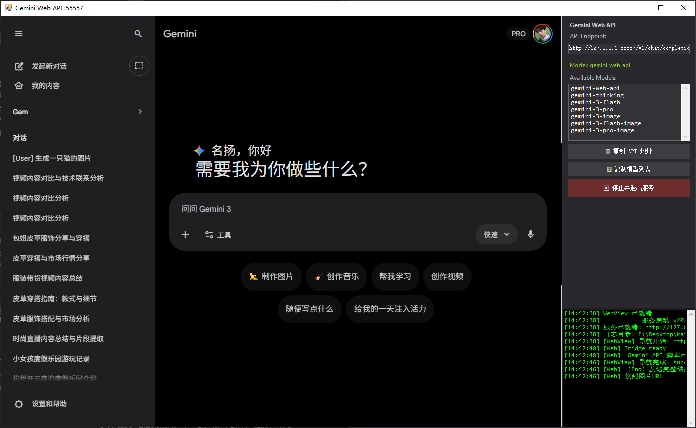

# Gemini Web-to-API Skill (Quicker Integration)

本技能通过集成 [Quicker Gemini-Web-API 动作](https://getquicker.net/Sharedaction?code=54037596-7003-47cb-dca5-08de3bb54158) 为 Agent 提供 Gemini 网页版的高级模型支持，包括最新的思维链模型 (Thinking) 和 banana 生图。

## 🌟 核心能力
- **推理增强**: 支持 `gemini-thinking`，适合处理复杂代码逻辑和深度分析。
- **全能对话**: 默认使用 `gemini-3-flash`，平衡速度与理解力。
- **高清生图**: 使用 `gemini-3-image` 系列模型生成高质量图像素材。
- **视频理解**: 支持本地视频自动压缩并上传，利用 Gemini 的长上下文能力进行视频分析。

## 🛠️ 首次使用配置指南

### 1. 准备 Quicker 环境 (核心)
本插件运行在 Quicker 动作提供的代理之上。
1.  **下载 Quicker**: [getquicker.net](https://getquicker.net/Download)
2.  **安装动作**: [Gemini 网页转 API 提供服务](https://getquicker.net/Sharedaction?code=54037596-7003-47cb-dca5-08de3bb54158)
3.  **运行动作**: 在 Quicker 中启动动作，并保持其运行。

### 2. 本地环境准备
*   **安装 FFmpeg (推荐)**: 视频分析功能依赖 FFmpeg 进行智能压缩以实现极速上传。
    *   **Windows**: `choco install ffmpeg` 或从 [ffmpeg.org](https://ffmpeg.org/download.html) 下载。

### 3. 连接验证
安装并配置完成后，您可以直接在 AI 助手中发送指令：
> "确认 gemini-web-quicker 技能配置好了吗？帮我查看一下支持的模型。"

---

## 📖 技能使用 (示例指令)

- **逻辑推理**: "请用 gemini-thinking 帮我分析这个算法的优化空间。"
- **高清绘图**: "用 gemini-3-pro-image 生成一张 16:9 的森林精灵背景图。"
- **视频分析**: "请分析这个剪辑素材的内容：[视频路径]"
- **查看模型**: "查看现在有哪些模型可以用。"

## 📂 目录结构
- `scripts/`: 核心执行脚本 (Chat, Image, List)。
- `libs/`: API 客户端封装。
- `generated_assets/`: 默认图片输出路径。

---

## 🤖 支持的模型列表 (Gemini Web API)

- `gemini-web-api`
- `gemini-thinking` (思考模型)
- `gemini-3-flash` (快速多模态)
- `gemini-3-pro` (高理解力)
- `gemini-3-image` (标准绘图)
- `gemini-3-flash-image` (快速绘图)
- `gemini-3-pro-image` (精品绘图)

---

## ❓ 常见问题排查 (Troubleshooting)

### 1. 连接失败 (Connection Refused)
*   **解决方法**: 确保 Quicker 动作已经启动并显示“服务已开启”。检查端口号是否为 `55557`，并与 `config.json` 同步。

### 2. 网页验证问题
*   **现象**: 请求返回 403 或 500。
*   **解决方法**: 请检查浏览器中的 Gemini 网页是否已掉线或弹出验证码。Quicker 动作依赖活跃的网页 Session。
